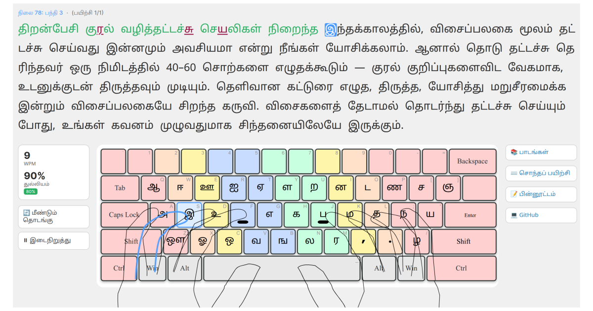

[English](README.md) | [தமிழ்](README.ta.md)

# eluthu: Master Tamil Touch Typing

**▶ [Let's Start Now](https://ennumezuththum.github.io/eluthu/)** — Free, runs entirely in your browser, nothing to install.



**eluthu** is a free, open-source Tamil touch typing tutor designed to help anyone type Tamil faster, accurately, and effortlessly.

Ten years ago, [TypingClub](https://www.typingclub.com/) transformed my English typing skills. When I couldn't find a similar dedicated tool for Tamil, I decided to build **eluthu**.

---

## Why Touch Typing?

You might wonder why keyboard typing still matters in the era of smartphones and voice-to-text tools.

While voice dictation works well for quick notes, serious writing requires editing, refining, and restructuring—tasks that demand manual input. If you write regularly, typing efficiently on a physical keyboard remains essential.

Efficient touch typing relies on three core principles:
1. **Minimizing keystrokes**
2. **Shortening finger movement distance**
3. **Avoiding awkward key combinations** (such as heavy reliance on the `Shift` key)

Most importantly, touch typing lets you keep your eyes on the screen, allowing you to focus completely on your thoughts rather than searching for keys.

---

## Why Tamil 99?

There are several Tamil keyboard layouts in use today. The three best-known are **Tamil 99**, **Bamini**, and **Anjal Phonetic**.

- **Tamil 99** optimizes key placement for fast, logical typing on standard QWERTY keyboards, using a consonant-vowel pattern (for example, கா = க [Key H] + ஆ [Key Q]).
- **Bamini** closely follows traditional Tamil typewriter conventions (for example, கா = க [Key i] + ா [Key m]).
- **Anjal Phonetic** follows a "type as you speak" approach — English letters map to similar-sounding Tamil characters (for example, கா = k + A [Key K + Shift + Key A]), making it intuitive for beginners.

For speed and efficiency, both Tamil 99 and Bamini are strong choices. **eluthu** teaches **Tamil 99** — standardized by the Tamil Nadu government and preferred by most professional Tamil writers. It relies on two key design principles:

1. **Frequency-Based Layout:** Keys are arranged based on how frequently letters occur in the Tamil language.
2. **Grammar-Optimized Flow:** It leverages natural Tamil grammar. For example, pure consonants (மெய்) are frequently followed by vowel-consonants (உயிர்மெய்), like **க்** and **க** in **வணக்கம்**. Tamil 99 makes these natural sequences fluid to type.

### Layout Comparison

Typing the word **வணக்கம்**:

| Layout | Keystrokes | Unique Keys | Requires `Shift` Key? |
| :--- | :---: | :---: | :---: |
| **Tamil 99** | **6** | **5** | **No** |
| Bamini | 6 | 5 | No |
| Phonetic (Anjal) | 7 | 6 | Yes |

While the difference seems minor for a single word, Tamil 99 and Bamini are closely matched on raw keystroke count. Tamil 99's advantage lies in *how* its keys are assigned: each key maps predictably to a Tamil grammar rule rather than needing to be memorized from typewriter-era conventions, which most learners find easier to reason about and retain. Against phonetic typing, the gap is more dramatic — Tamil 99 saves substantial unnecessary keystrokes when drafting longer articles.

---

## Key Features

- **Progressive Lessons:** Step-by-step curriculum that builds muscle memory naturally.
- **Finger-Position Learning:** Keys are introduced in ergonomic pairs based on home-row positioning rather than alphabetical order. (Your first two keys are **ப** via `J` and **்** pulli via `F`).
- **Visual Keyboard Guidance:** Dynamic visual guides display key placement and finger overlays. Only unlocked or currently practicing keys are visible to prevent cognitive overload.
- **Grammar Integration:** Consonants are introduced alongside high-efficiency grammar flows inherent to Tamil 99.
- **Interactive Messages:** Instructional screens between lessons guide you through the learning journey
- **Introduction, Practice & Review:** Each lesson has dedicated exercise phases — introduction (100% accuracy required), practice (90%), and review (80%) — so you build confidence before moving on.
- **Real Tamil Words:** Combination lessons use real Tamil words and phrases derived strictly from characters you have learned so far (capped at 50 words per exercise for optimal learning pace).
- **Local Progress Saving:** Your progress is saved automatically in your browser.
- **Free Typing Sandbox:** A dedicated space where you can paste custom Tamil text to practice freely.

---

## Privacy & Security

eluthu is designed to be completely private:

- **Zero Data Transmission:** Nothing you type ever leaves your device. All processing happens in your browser.
- **No Accounts Needed:** No registration, login, or personal details required.
- **Local Storage Only:** Progress is saved locally in your browser (`localStorage`). Clearing your browser data resets your progress.
- **Ad-Free & Tracker-Free:** No ads, analytics, or third-party tracking scripts.
-  **Open Source:** Licensed under the MIT License — all source code is publicly auditable in this repository.

---

## Roadmap

The following features are planned for future releases:

1. Full support for Grantha characters (ஸ, ஷ, ஜ, ஹ, க்ஷ) and numbers.

---

## How You Can Help

- **Use & Share:** Try eluthu and share it with students, writers, or anyone learning Tamil.
- **Provide Feedback:** Submit bug reports or feature requests via our [Quick Feedback Form](https://forms.gle/uwwtEWPmU6NVf6QaA) or [GitHub Issues](https://github.com/eNNumEzuththum/eluthu/issues).
- **Contribute Content:** Help expand our word database and lesson exercises.
- **Contribute Code:** Pull requests are always welcome!

**Contact:** [enn.eluththu@gmail.com](mailto:enn.eluththu@gmail.com)

---

## Developer Notes

### Run locally

1. Clone the repository:
   ```bash
   git clone https://github.com/eNNumEzuththum/eluthu.git
   cd eluthu
   ```
2. Start a local server:
   ```bash
   python3 -m http.server 8080
   ```

3. Open http://localhost:8080 in your web browser.


### Code Structure

```text
.
├── index.html                # Main entry point for the web application
├── tamil99-tester.html       # Free typing sandbox for custom Tamil text
├── css/
│   └── style.css             # Application styles
├── js/
│   ├── tamil99.js            # Tamil 99 layout rules and character mapping
│   ├── combination.js        # Keystroke stream engine for combination typing
│   ├── typing.js             # Standard character-by-character typing engine
│   ├── lessons.js            # Lesson loader and progression controller
│   ├── app.js                # Core application orchestrator
│   └── version.js            # Application versioning tracker
├── assets/
│   ├── keyboard.svg          # Keyboard layout diagram with finger guides
│   └── keyboard_all_keys.svg # Dual-labeled keyboard diagram (Tamil + English)
├── data/
│   ├── lessons.json          # Lesson manifest (ordering, metadata, exercise lists)
│   ├── tamil99-keymap.json   # QWERTY to Tamil 99 key bindings
│   └── exercises/
│       └── XX-XX.json        # Individual exercise JSON data files
├── lesson_plan.json          # Minimal hand-edited lesson definitions
├── words.txt                 # Frequently used Tamil word database
├── add_words_to_lesson.py    # Reads lesson_plan.json + words.txt → lesson_words.json
├── lesson_words.json         # Generated: lesson metadata + matched words per lesson
├── generate_lessons.py       # Reads lesson_words.json → data/lessons.json + exercises/
├── TESTS.md                  # Comprehensive test documentation
└── update-tests.sh           # Script to sync version details in TESTS.md
```

---

## Resources & References

- [Wikipedia: Tamil 99 Layout](https://en.wikipedia.org/wiki/Tamil_99)
- [Tamil Nadu Government Keyboard Documentation](https://www.tamilvu.org/tkbd/doc_file/Help_Linux.pdf)
- [Interactive Tamil 99 Layout Map](https://kbdlayout.info/kbdtam99)
- [Tamil 99 Keyboard Help Chart (PDF)](https://help.keyman.com/keyboard/ekwtamil99uni/2.0.5/chart.pdf)
- [W3Tamil Online Tamil 99 Typing](https://wk.w3tamil.com/)
- [TypingClub (English Touch Typing)](https://www.typingclub.com/)

---

## License

Distributed under the MIT License. See LICENSE for details.

Free to use, modify, and distribute. Contributions are welcome!

---
