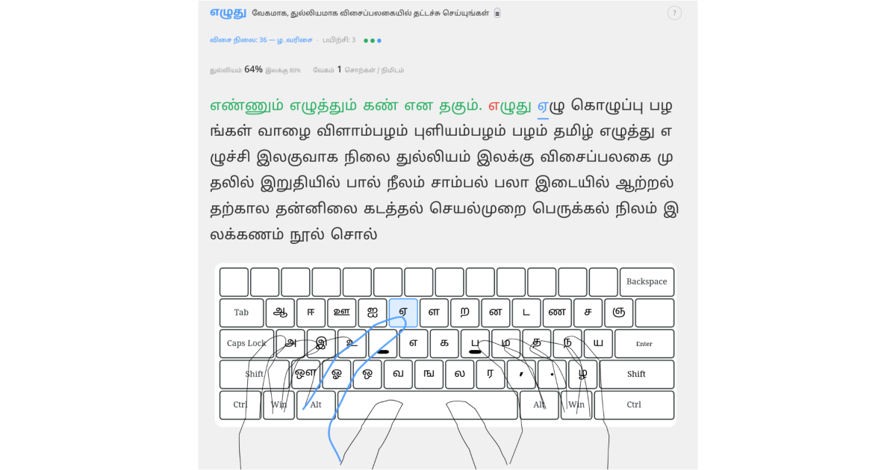

[English](README.md) | [தமிழ்](README.ta.md)

# எழுது (eluthu): தமிழ் தொடு-தட்டச்சுப் பயிற்சி

**▶ [இப்போதே தொடங்குங்கள்](https://ennumezuththum.github.io/eluthu/)** — முற்றிலும் இலவசம், உங்களது கணினி உலாவியிலேயே (Browser) நேரடியாக இயங்கும், மென்பொருள்கள் எதுவும் தரவிறக்க வேண்டியதில்லை.

**எழுது (eluthu)** என்பது தமிழை வேகமாகவும், துல்லியமாகவும், இலகுவாகவும் தொடு-தட்டச்சு பழக உதவும் ஒரு இலவச மற்றும் திறந்த மூல (Open-Source) தமிழ் தட்டச்சுப் பயிற்சித் தளமாகும்.

பத்து வருடங்களுக்கு முன்னர், [TypingClub](https://www.typingclub.com/) எனது ஆங்கிலத் தொடு-தட்டச்சுத் திறனைப் பெருமளவில் மாற்றியமைத்தது. தமிழுக்கும் அதுபோன்ற ஒரு பயிற்சித் தளம் இல்லாததைக் கண்டபோதே, **எழுது** செயலியை உருவாக்கத் தீர்மானித்தேன்.

---

## ஏன் தொடு-தட்டச்சு (Touch Typing)?

திறன்பேசி (smartphones) குரல் வழித் தட்டச்சு (Voice-to-Text) செயலிகள் நிறைந்த இந்தக் காலத்தில், விசைப்பலகை (keyboard) மூலம் தட்டச்சு செய்வது இன்னமும் அவசியமா என்று நீங்கள் யோசிக்கலாம்.

சின்னச் சின்னக் குறிப்புகளைக் குரல் வழியில் சொல்வது இலகுவாக இருந்தாலும், தெளிவான ஒரு கட்டுரையை எழுதவோ அல்லது திருத்தி அமைக்கவோ கைமுறையான திருத்தங்கள் (Manual editing) கட்டாயம் தேவை. நீங்கள் தொடர்ச்சியாகக் கட்டுரைகள் எழுதுபவர் என்றால், விசைப்பலகையில் திறம்படத் தட்டச்சு செய்யும் திறன் மிகவும் அவசியமானது.

திறமையான தட்டச்சுப் பயிற்சி மூன்று முக்கிய அம்சங்களை அடிப்படையாகக் கொண்டது:
1. **விசை அழுத்தங்களைக் (Keystrokes) குறைத்தல்**
2. **விரல்களின் நகர்வுத் தூரத்தைக் குறைத்தல்**
3. **சிக்கலான விசைச் சேர்க்கைகளைத் தவிர்த்தல்** (எடுத்துக்காட்டாக `Shift` விசையை அதிகமாகப் பயன்படுத்துவதைத் தவிர்த்தல்)

அனைத்துக்கும் மேலாக, தொடு-தட்டச்சுப் பயிற்சி மூலமாக விசைகள்  எங்கே இருக்கின்றன என்று தேடாமல், நீங்கள் திரையில் (screen)  பார்வையைவைத்து முழுச் சிந்தனையோடும் தட்டச்சு செய்ய முடியும் (focus completely on your thoughts).

---

## ஏன் தமிழ் 99 (Tamil 99)?

சிலர் ஒலிபெயர்ப்பு (Phonetic) முறையை (உதாரணம்: **வணக்கம்** த்தை `vaNakkam`) எனத் தட்டச்சு செய்வார்கள். ஆனால் தொழில்முறைத் (professional) தமிழ் எழுத்தாளர்கள் **தமிழ் 99** முறையையே பயன்படுத்துகிறார்கள். தமிழ்நாடு அரசால் முறைப்படுத்தப்பட்ட தமிழ் 99 விசைப்பலகை இரண்டு முக்கிய அமைப்புக் கோட்பாடுகளைக் கொண்டது:

1. ** அதிக பயன்பாட்டு வடிவம் (Frequency-Based Layout):** தமிழ் மொழியில் அதிகம் பயன்படும் எழுத்துக்களை மையமாகக் கொண்டு விசைகள் அமைக்கப்பட்டுள்ளன.
2. **இலக்கணச் சீரமைப்பு முறை (Grammar-Optimized Flow):** தமிழ் இலக்கணத்தின் இயல்பை இது சாதகமாகப் பயன்படுத்துகிறது. உதாரணமாக, சொற்களில் ஒரு மெய்யெழுத்தைத் தொடர்ந்து உயிர்மெய்யெழுத்து வருவது இயல்பு (எ.கா: **வணக்கம்** என்பதில் **க்** அடுத்து **க** வருவது போல). தமிழ் 99 இந்த இயல்பான வரிசையை இலகுவாகத் தட்டச்சு செய்ய வழிவகுக்கிறது.

### ஒலிபெயர்ப்பு vs தமிழ் 99 ஒப்பீடு

**வணக்கம்** என்ற சொல்லைத் தட்டச்சு செய்ய:

| விசைப்பலகை அமைப்பு | விசை அழுத்தங்கள் (Keystrokes) | தனித்துவமான விசைகள் | `Shift` விசை தேவையா? |
| :--- | :---: | :---: | :---: |
| **தமிழ் 99** | **6** | **5** | **இல்லை** |
| ஒலிபெயர்ப்பு (Phonetic) | 7 | 6 | ஆம் |

ஒரு சிறிய சொல்லுக்கு இது பெரிய வித்தியாசமாகத் தெரியாவிட்டாலும், நீண்ட கட்டுரைகளை எழுதும்போது தமிழ் 99  தேவையற்ற விசை அழுத்தங்களைக் நிறைய மிச்சப்படுத்துகிறது.

---

## முக்கிய அம்சங்கள்

-  **படிப்படியான பாடங்கள் (Progressive Lessons):** உங்கள் விரல்களுக்குத் தானாகவே பழகும் வகையில் (Muscle memory) கட்டம் கட்டமாக வடிவமைக்கப்பட்ட பயிற்சிகள்.
-  **விரல்-இட வழிகாட்டல் (Finger-Position Learning):** அகரவரிசையில் இல்லாமல், விரல்களின் இயல்பான நிலைக்கு ஏற்ப சோடிச் சோடியாக எழுத்துக்கள் அறிமுகப்படுத்தப்படுகின்றன. (நீங்கள் முதன்முதலில் படிக்கும் இரு எழுத்துக்கள்: `J` விசையிலுள்ள **ப** மற்றும் `F` விசையிலுள்ள **்** புள்ளியும் ஆகும்).
-  **திரையில் தெரியும் வழிகாட்டி (Visual Keyboard Guidance):** எந்த விரலால் எந்த விசையை அழுத்த வேண்டும் என்பதைத் திரையிலேயே காட்டும் நேரடி வழிகாட்டி. குழப்பங்களைத் தவிர்க்க, நீங்கள் பழகும் அல்லது பழகிய எழுத்துக்கள் மட்டுமே திரையில் தெரியும்.
-  **இலக்கண ஒருங்கிணைப்பு (Grammar Integration):** அடிப்படை உயிர் எழுத்துக்களுக்குப் பிறகு, மெய் எழுத்துக்கள் தமிழ் 99 இன் இயல்பான இலக்கண ஓட்டத்தோடு அறிமுகப்படுத்தப்படுகின்றன.
-  **சுய முன்னேற்றச் சேமிப்பு (Local Progress Saving):** உங்களது பயிற்சி நிலைகள் உங்களது கணினி உலாவியிலேயே தானாகவே சேமிக்கப்படும்.
-  **சுய பயிற்சித் தளம் (Free Typing Sandbox):** நீங்கள் விரும்பும் எந்தவொரு தமிழ் உரையையும் பிரதியெடுத்து (Copy-paste) சுதந்திரமாகத் தட்டச்சுப் பயிற்சி செய்வதற்கான தனிப்பகுதி.

---

## தனிப்பாதுகாப்பு & நம்பகத்தன்மை (Privacy & Security)

எழுத்து செயலி முற்றிலும் உங்களது தனிப்பாதுகாப்பை உறுதி செய்யும் வகையில் உருவாக்கப்பட்டுள்ளது:

-  **தரவுகள் எதுவும் வெளியேறாது:** நீங்கள் தட்டச்சு செய்வது எதுவும் உங்களது கணணியை விட்டு வெளியே போகாது. அனைத்துச் செயல்பாடுகளும் உங்களது கணினி உலாவியிலேயே நடைபெறுகின்றன.
- **கணக்குகள் எதுவும் தேவையில்லை:** பதிவு செய்வதோ, அல்லது உங்களது தனிப்பட்ட விபரங்களைக் கொடுப்பதோ தேவையில்லை.
-  **உலாவியில் மட்டுமே சேமிக்கப்படும்:** பயிற்சிகள் பற்றிய விபரங்கள் உங்களது உலாவியில் (`localStorage`) மட்டுமே சேமிக்கப்படும். உலாவியின் தரவுகளை அழித்தால் (Clear browser data) அது முழுமையாக அழிந்துவிடும்.
-  **விளம்பரங்களோ கண்காணிப்புகளோ இல்லை:** விளம்பரங்கள், பகுப்பாய்வு (Analytics) அல்லது உங்களைக் கண்காணிக்கும் ஸ்கிரிப்ட்கள் எதுவுமே இதில் இல்லை.
-  **திறந்த மூல மென்பொருள் (Open Source):** MIT உரிமத்தின் கீழ் வெளியிடப்பட்டுள்ளது — இதன் மூலக் குறியீடுகள் (Source code) அனைத்தையும் யார் வேண்டுமானாலும் சோதித்துப் பார்க்கலாம்.

---

## எதிர்காலத் திட்டங்கள் (Roadmap)

எழுத்து செயலி தற்போது முதற்கட்டத்தில் (Alpha version) உள்ளது. எதிர்காலத்தில் பின்வரும் அம்சங்கள் சேர்க்கப்படும்:

1. ஆரம்பப் பாடங்களுக்கான வழிகாட்டி ஒலிக்குறிப்புகள் மற்றும் அசைவூட்டங்கள் (Animations).
2. கிரந்த எழுத்துக்கள் (ஸ, ஷ, ஜ, ஹ, க்ஷ) மற்றும் எண்களுக்கான முழுமையான ஆதரவு.

---

## நீங்கள் எவ்வாறு உதவலாம்?

-  **பயன்படுத்துங்கள் & பகிருங்கள்:** எழுத்து செயலியைப் பயன்படுத்திப் பாருங்கள்; மாணவர்கள், எழுத்தாளர்கள் மற்றும் தமிழ் தட்டச்சு கற்க விரும்பும் அனைவருக்கும் இதைப் பகிருங்கள்.
-  **கருத்துக்களைப் பகிருங்கள்:** பிழைகள் ஏதும் இருந்தால் அல்லது புதிய யோசனைகள் இருந்தால் உங்களது பின்னூட்டங்களை [கருத்துப் படிவம் (Feedback Form)](https://forms.gle/uwwtEWPmU6NVf6QaA) மூலமாகவோ அல்லது [GitHub Issues](https://github.com/eNNumEzuththum/eluthu/issues) வழியிலோ அறியத் தாருங்கள்.
-  **பயிற்சிகளை விரிவாக்க உதவுங்கள்:** புதிய தமிழ் சொற்களையும் பயிற்சிகளையும் சேர்த்து எமது சொல் வங்கியை விரிவுபடுத்த உதவுங்கள்.
- **குறியீட்டுப் பங்களிப்பு:** கணினி நிரலாக்கப் பங்களிப்புகள் (Pull requests) எப்போதும் அன்போடு வரவேற்கப்படுகின்றன!

**தொடர்புகளுக்கு:** [enn.eluththu@gmail.com](mailto:enn.eluththu@gmail.com)

---

## அடிக்கடி கேட்கப்படும் வினாக்கள் (FAQ)

#### கேள்வி: நான் விசைகளை அழுத்தும்போது எழுத்துக்கள் எதுவுமே தெரியவில்லையே, நான் தனியாக தமிழ் எழுத்துரு  (Font) எதுவும் தரவிறக்க வேண்டுமா?
**பதில்:** எந்தவொரு எழுத்துரு  தரவிறக்க வேண்டிய அவசியமில்லை. தேவையான தமிழ் எழுத்துரு  செயலியிலேயே இணைக்கப்பட்டுத் தானாகவே இயங்கும். 

*குறிப்பு:* **எழுத்துக்கள் படிப்படியாகவே திறக்கப்படும்.** ஒவ்வொரு பாடத்திலும் அதுவரை அறிமுகப்படுத்தப்பட்ட எழுத்துக்கள் மட்டுமே தெரியும். நீங்கள் முதலில் படிக்கும் இரண்டு எழுத்துக்கள் **ப** (`J` விசை) மற்றும் **்** புள்ளி (`F` விசை) ஆகும். முந்தைய பயிற்சிகளை முடித்த பிறகே அடுத்தடுத்த எழுத்துக்கள் திறக்கப்படும்.

#### கேள்வி: எழுது செயலியின் பழைய பதிப்பே திரையில் தெரிகிறது, புதிய பதிப்பை எவ்வாறு பெறுவது?
**பதில்:** உங்களது உலாவி பழைய பதிப்பை நினைவகத்தில் (Cache) வைத்திருக்கலாம். புதிய பதிப்பைப் பெற உங்களது உலாவியை வன்-மறுநிரப்பல் (Hard refresh) செய்யுங்கள்:
- **Windows / Linux:** `Ctrl` + `Shift` + `R` (அல்லது `Ctrl` + `F5`) விசைகளை அழுத்தவும்.
- **Mac:** `Cmd` + `Shift` + `R` விசைகளை அழுத்தவும்.
